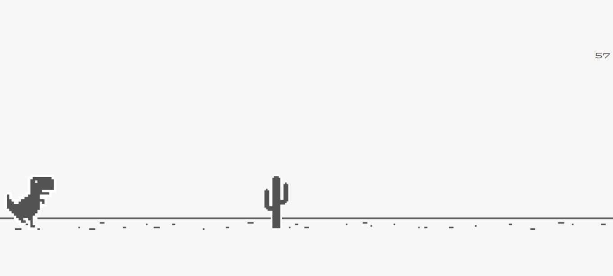

<h1 align="center"> T REX Running. </h1>

 O jogo "offline" do Google.

  <a href="#-tecnologias">Tecnologias</a>&nbsp;&nbsp;&nbsp;|&nbsp;&nbsp;&nbsp;
  <a href="#-projeto">Projeto</a>&nbsp;&nbsp;&nbsp;

  

## 🔖 Preview

 

  

 

### Divirta-se e faça seu Record jogando. ➡️ [LINK.](https://kiqprado.github.io/T-Rex-Running/)

 

## 🚀 Tecnologias

Esse projeto foi desenvolvido com as seguintes tecnologias:

- HTML e CSS
- JavaScript

## 💻 Projeto

Conteúdo adaptado de um vídeo com desenvolvimento em  JavaScript.  
Veja o vídeo do projeto através [DESSE LINK](https://www.youtube.com/watch?v=47eXVRJKdkU&list=PLiMI9N-yw-3FF0X-TMdbf4T91M1BSvqff&index=12).

 

Curiosidade: Gosto tanto deste jogo que até tenho uma tattoo em homenagem.

  

  
  &nbsp;&nbsp;&nbsp;|&nbsp;&nbsp;&nbsp;
  
 

